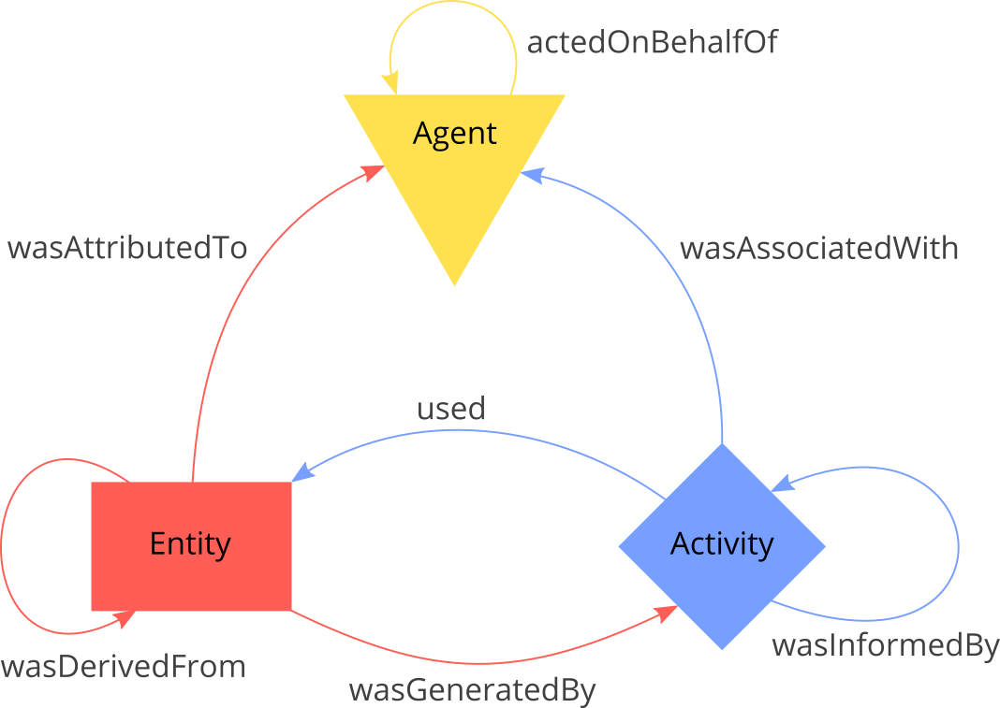
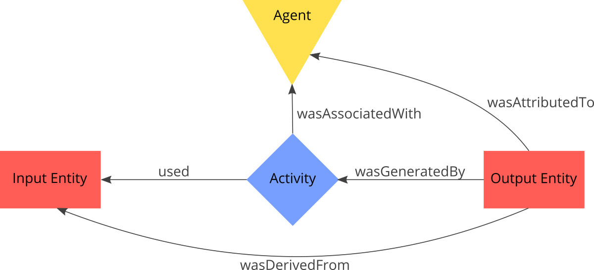

# README

The package creates provenance graphs according to PROV-O (i.e. in RDF). _The package is based on __rdflib___. https://rdflib.readthedocs.io/en/stable/rdf_terms.html

## Installation

1. Download and unzip the package
2. Open Shell and _cd_ to unzipped package
3. Run "pip install -e ." (in the folder that contains ```setup.py```)

## Contents

The package implements the PROV-O (https://www.w3.org/TR/prov-o/#starting-points-figure, graphic below) classes __Entity__, __Activity__ and __Agent__ as Python classes with methods to establish the basic relations (Arrows) between instances of those classes. Those relations are called _properties_. It also contains utilities to ease the provenance graph construction.



## Functionality

It is assumed that the basic unit of a provenance graph is an _Activity_ with a number of _Input Entities_ and _Output Entities_ that is possibly controlled by an _Agent_. The following graphic shows this unit together with the resulting properties:



The script to generate this basic unit is provided in the _examples_ folder as ```provBasicExample.py```:

```python
from provo import ProvGraph, Activity, Entity, Agent

# setup the graph object (subclass of an rdflib-graph)
g = ProvGraph(namespace='https://provBasicExample.org/')


# at first we create all required objects
inputEntity = Entity(graph = g, id = 'inputEntity')
# any PROV-O object can have a label and a description
inputEntity.label('Input Entity')
inputEntity.description('This is the first entity')

outputEntity = Entity(g, 'outputEntity')

activity = Activity(g, 'activity')

agent = Agent(g, 'agent')


# now we build the relations
activity.used(inputEntity)
activity.wasAssociatedWith(agent)
outputEntity.wasGeneratedBy(activity)
outputEntity.wasAttributedTo(agent)
outputEntity.wasDerivedFrom(inputEntity)


# finally serialize the graph
path = './examples/out/provBasicExample_n3.rdf'
g.serialize(format = 'n3', destination = path)
```

Every object of the type _Agent_, _Activity_ and _Entity_ needs a unique identifier. This identifier needs to be an alphanumeric string without empty spaces. The instantiation also requires the graph to which the object should be added ```newEntity = Entity(graph = provGraph, id = 'newEntity')``` as input.

### Real world provenance graph can get much larger

The folder _examples_ contains an example document, which describes the serialization of an ArcGIS Workflow description into a provenance graph RDF. The folder _out_ contains this graph. The ESRI tutorial with the example workflow isa available ar http://webhelp.esri.com/arcgisdesktop/9.3/pdf/Geoprocessing_in_ArcGIS_Tutorial.pdf, p. 36ff. The following figure shows the workflow (The _wasDerivedBy_ properties between _Entities_ are omitted):


The manual assignment of required properties in the graph (arrows) gets time-consuming and can lead to errors. The class ```ProvGraph``` provides a utility method called ```link``` that simplifies this task. The following example describes the "Intersect" Activity, which is shown graph above:

```python
elev = Entity(g, 'ElevationsLessThan250m')
slopes = Entity(g, 'SlopesLessThan40Percent')
climate = Entity(g, 'ClimateZones')
intersect = Activity(g, 'Intersect')
intersectOut = Entity(g, 'intersectOutput')
g.link(
    inputs = [elev, slopes, climate, suitMinusRoads],
    process = intersect,
    outputs = intersectOut,
    agents = None
)
```

Every parameter of the link method can be set as list of according PROV-O objects or as single object. Every time the link method is called, it checks if there is a resulting _wasInformedBy_ property that needs to be added to the graph (and adds it). This auto-inferencing of the ```link```-method can and should be deactivated when constructing large graphs ( ```g.link(..., inference = False) ```).

<!-- Additionally, every _Activity_ can be assigned a start and end time. The format of this time has to be a python ```datetime``` object: 

```python
from datetime import datetime

buffer = Activity(g, 'Buffer')
buffer.startedAtTime(datetime(2020, 6, 6, 12, 0, 0))
buffer.endedAtTime(datetime(2020, 6, 6, 12, 4, 30))
``` -->
## Used Packages

- rdflib: https://rdflib.readthedocs.io/en/stable/, BSD License

## License

## Contact

Arne Rümmler ([arne.ruemmler@tu-dresden.de](mailto:arne.ruemmler@tu-dresden.de))
