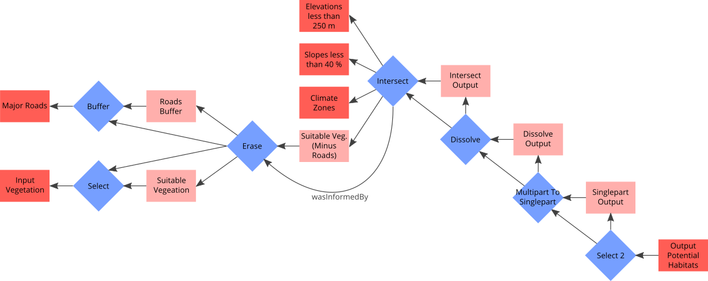

# README

Construct provenance graphs according to PROV-O. _The package is based on __rdflib___. https://rdflib.readthedocs.io/en/stable/rdf_terms.html

## Installation

1. Download and extract the package
2. Open Shell and _cd_ to extracted package
3. Run "pip install -e ." (in the folder that contains ```setup.py```)

## Contents

The package implements the PROV-O (https://www.w3.org/TR/prov-o/#starting-points-figure, graphic below) classes __Entity__, __Activity__ and __Agent__ as Python classes with methods to establish the basic relations (Arrows) between instances of those classes. Those relations are called _properties_. It also contains utilities to ease the provenance graph construction.


## Functionality

It is assumed that the basic unit of a provenance graph is an _Activity_ with a number of _Input Entities_ and _Output Entities_ that is possibly controlled by an _Agent_. The following graphic depicts this unit together with the resulting properties:


The script to generate this basic unit is provided in the _examples_ folder as ```provBasicExample.py```:

```python
from provit import ProvGraph, Activity, Entity, Agent

'''setup the graph object (subclass of an rdflib-graph)'''
g = ProvGraph(namespace='https://provBasicExample.org/')


'''at first we create all required objects'''
inputEntity = Entity(graph = g, id = 'inputEntity')
# any PROV-O object can have a label and a description
inputEntity.label('Input Entity')
inputEntity.description('This is the first entity')

outputEntity = Entity(g, 'outputEntity')
activity = Activity(g, 'activity')
agent = Agent(g, 'agent')


'''now we build the properties'''
activity.used(inputEntity)
activity.wasAssociatedWith(agent)
outputEntity.wasGeneratedBy(activity)
outputEntity.wasAttributedTo(agent)
outputEntity.wasDerivedFrom(inputEntity)


'''finally serialize the graph'''
path = 'provit/examples/out/provBasicExample_n3.rdf'
g.serialize(format = 'n3', destination = path)
```

Every object of the type _Agent_, _Activity_ and _Entity_ needs a unique identifier on instantiation. This identifier has to be given as string on object instantiation. It has to be alphanumeric without empty spaces. Instantiation also requires the graph to which the object should be added ```newEntity = Entity(graph = provGraph, id = 'newEntity')```.

### A real provenance graph consists of multiple basic units

The folder _examples_ provides an example document that features the serialization of an ArcGIS Workflow into a provenance graph. The folder _out_ contains this graph. The tutorial containing the example workflow can be found under http://webhelp.esri.com/arcgisdesktop/9.3/pdf/Geoprocessing_in_ArcGIS_Tutorial.pdf, p. 36ff. The following graphic depicts the workflow (The _wasDerivedBy_ properties between _Entities_ are omitted):



The manuel assignment of every required property in the graph (arrows) can become time consuming and is error prone. The class ```ProvGraph``` provides a utility method called ```link``` that simplifies this task. The following example is for the "Intersect"-Activity in the graph above:

```python
elev = Entity(g, 'ElevationsLessThan250m')
slopes = Entity(g, 'SlopesLessThan40Percent')
climate = Entity(g, 'ClimateZones')
intersect = Activity(g, 'Intersect')
intersectOut = Entity(g, 'intersectOutput')
g.link(
    inputs = [elev, slopes, climate, suitMinusRoads],
    process = intersect,
    outputs = intersectOut
    agents = None
)
```

Every parameter of the link method accepts lists of according PROV-O objects as well as single objects. Also, every time the link method is called, it checks if there is a resulting _wasInformedBy_ property that needs to be added to the graph (and adds it if so).

Additionally, every _Activity_ can be assigned a start and end time. The format of this time has to be a python ```datetime``` object: 

```python
from datetime import datetime

buffer = Activity(g, 'Buffer')
buffer.startedAtTime(datetime(2020, 6, 6, 12, 0, 0))
buffer.endedAtTime(datetime(2020, 6, 6, 12, 4, 30))
```