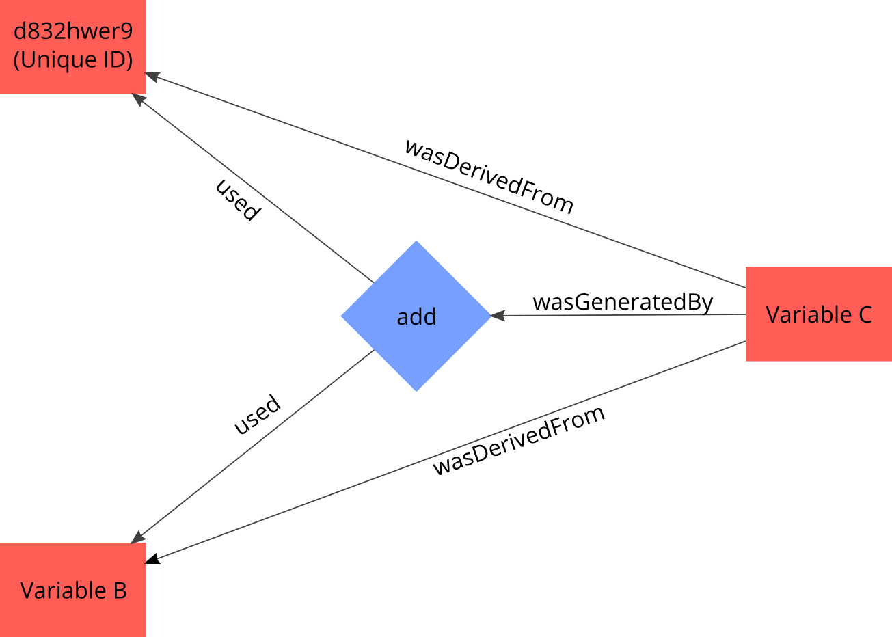
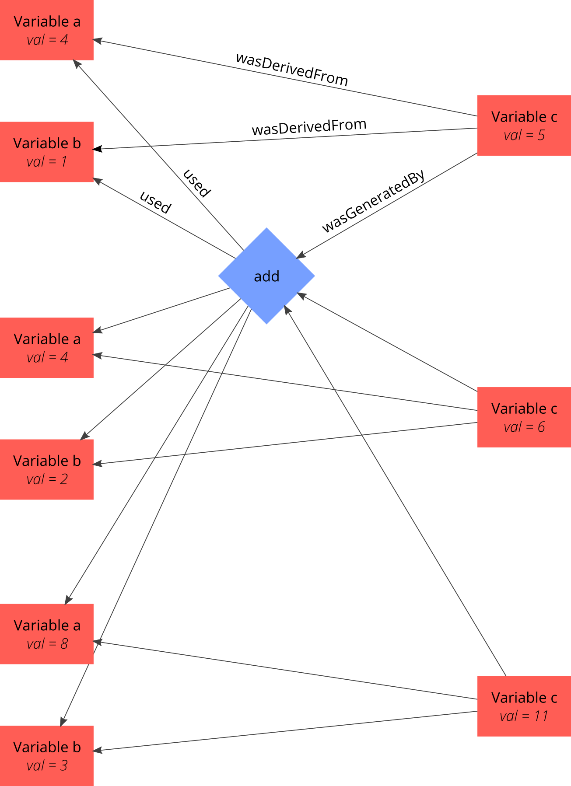
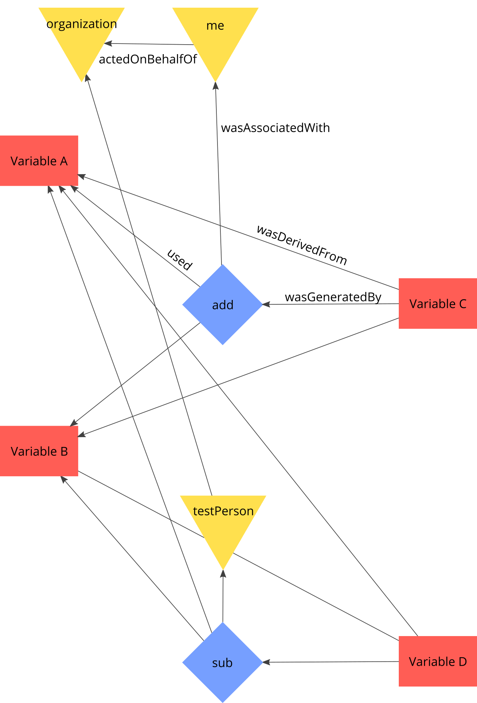
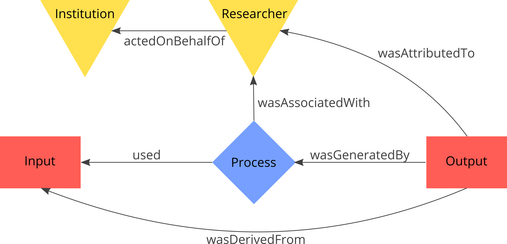

# ProvIt

__--- IN DEVELOPMENT ---__

*This package aims at supporting the tracking of provenance of Python-scripted workflows as an RDF-Graph (semantic graph), according to the PROV-Ontology. <br/> It's build upon the __rdflib-package__, <https://rdflib.readthedocs.io/en/stable/index.html>.*

*A future tool will allow for a meaningful visualization of provenance stored in a fashion this package provides.*

*While the ProvIt-Package tries to enable the tracking of provenance without further knowledge of semantic graph databases or the PROV-Ontology, the end of this document provides some  foundational concepts.*

## Getting started

The package assumes that a certain workflow is constructed out of a set of processes with well defined inputs and outputs. Such a process is typically written down as a method:

```python
def add(x,y):
    z = x + y
    return z

a = 4
b = 5
c = add(a,b)
```

In this simple case the process is the addition of two numbers. If we use the ProvIt package in this example the code looks as follows:

```python
from ProvIt import ProvenanceEngine

# define your methods
def add(x, y):
    # add two numbers
    z = x + y
    return z

# setup the provenance engine object and provide it with a namespace
# and it's abbreviation. It defaults to:
# namespace = 'https://your.project.com/example#', abbreviation = 'ex'
# every module should have it's own namespace
provEngine = ProvenanceEngine(
    namespace = 'https://usefulmodulecollection.org/modul1#', 
    abbreviation = 'm1'
)


a = 4
# the crucial part of the sematic graph are the unique IDs of every node.
# These IDs are returned as you call the add*()-methods:
aID = provEngine.addEntity()


b = 5
# you can and should provide Entities with a human-readable label and a 
# detailed description. If no label is provided it defaults to the global
# identifier, which isn't meaningful (it's just unique).
bID = provEngine.addEntity(
    label = 'Variable B',
    description = "its value is: " + str(b)
)


c = add(a,b)
# add the result as entity.
cID = provEngine.addEntity('Variable C', 'A + B = ' + str(c))


# add the process to the graph
procID = provEngine.addProcess(
    label = 'add',
    description = 'adds two numbers and gives out a sum'
)

# finally connect the nodes
provEngine.relateProcessAndEntities(
    inputIDs = [aID,bID],
    outputIDs = cID,
    processID = procID
)

# save the graph in the Turtle format
provEngine.serialize('module1.ttl')
```

It seems quite a lot to type. But while the lines of code per method can scale indefinitely, the lines to track the provenance of this method stays pretty much constant. The above code would generate a semantic graph which (in a simplified version) looks like this:

<center></center>

## Further examples

The following examples shall demonstrate some common use cases and give additional information on the functionality of the package. Further down the line you will find a short documentation of all available methods.

## Looping over a process

A little more complex example would be the addition of the elements of two lists:

```python
from ProvIt import ProvenanceEngine

# define your methods
def add(x, y):
    # add two numbers
    z = x + y
    return z

# setup the provenance engine object and provide it with a namespace
provEngine = ProvenanceEngine(
    namespace = 'https://usefulmodulecollection.org/modul1#', 
    abbreviation = 'm1'
)


# add the process to the graph
procID = provEngine.addProcess(
    label = 'add',
    description = 'adds two numbers and gives out a sum'
)


# define lists
A = [4,4,8]
B = [1,2,3]

# add the elements and construct the according entities and 
# relations between them on the flow

C = []
for i in range(3):
    a = A[i]
    aID = provEngine.addEntity(
        label = 'Variable a',
        description = "its value is: " + str(a)
    )

    b = B[i]
    bID = provEngine.addEntity(
        label = 'Variable b',
        description = "its value is: " + str(b)
    )

    c = add(a,b)
    cID = provEngine.addEntity('Variable c', 'a + b = ' + str(c))
    C.append(c)

    # connect the nodes
    provEngine.relateProcessAndEntities(
        inputIDs = [aID,bID],
        outputIDs = cID,
        processID = procID
    )

# save the graph in the Turtle format
provEngine.serialize('example2.ttl')
```

A simplified visualization of the provenance looks like this:

<center></center>

Notice that all inputs and outputs were generated by or used the same process, while the relation between specific entities is provided by the wasDerivedFrom connection.

An other approach to add the two vectors would be to adapt `add(...)`, so that it accepts lists as input and also delivers a list as output. The resulting provenance in this case would look very similar to first example (the entities are now lists of values instead of single values).

> __Note__ You can define the nodes of your provenance graph at any scope of your program, it needs to fit your needs. I recommend to always define them one scope on top of the method you want track. In the above example, if we would have defined the entities and the process inside `add(...)`, it would have generated three different processes which are all identical in what they do - adding numbers. Also, if you make use of other third party libraries you are not able to implement the definition of your nodes inside the concrete methods source code, therefore it is better to keep a consistent style and always define them outside.

## Nested methods

If nested method are tracked as provenance, __the outer method(s) should not be tracked__. To keep track of the nesting, `addProcess(...)` is provided with an optional variable called `scope`, which defaults to `False`. If it is set to `True`, _ProvIt_ makes use of the `traceback`-module, which is designed to trace back errors (<https://docs.python.org/3/library/traceback.html>). Therefore it can trace the current scope up to the uppermost one. This information is added to the graph via: `currentProcess wasCalledFromScope farOutMethod/outerMethod/innerMethod`.

In the case of tracking nested methods, it is often times useful to stray away from the from the note above and define the output-entities of the outer method inside the outer method itself and return the IDs (see example).

```python
from ProvIt import ProvenanceEngine


# define your methods
def add(x, y):
    # add two numbers
    z = x + y
    return z


def subtract(x,y):
    # subtract two numbers
    z = x - y
    return z


def arbitraryOuterMethod(x, y ,xID, yID, engine):
    # to track the provenance of a nested method inside an outer method,
    # the outer method needs to be provided with the provenanceEngine-object
    # and the IDs of the input. 
    # this should be by giving it as parameter, since it makes the methods 
    # more generic.
    # python scoping rules could also be leveraged

    # add process to graph

    # if scope is true, additional information from which scope in your program
    # the added method was called is added.
    # in this case: addID wasCalledFromScope arbitraryOuterMethod
    # if the nesting is deeper the hierarchy of the scopes is indicated by '/'
    # e.g.: addID wasCalledFromScope arbitraryOuterMethod/arbitraryInnerMethod
    addID = engine.addProcess(
        label = 'add',
        description = 'adds two numbers and gives out a sum',
        scope = True
    )

    z = add(x,y)

    zID = engine.addEntity(
        label = 'Variable z',
        description = "its value is: " + str(z)
    )

    engine.relateProcessAndEntities(
        inputIDs = [xID,yID],
        outputIDs = zID,
        processID = addID
    )

    three = 3
    threeID = engine.addEntity(
        label = 'constant three',
        description = "its value is: " + str(three)
    )

    # add process to graph
    subID = engine.addProcess(
            label = 'subtract',
            description = 'subtracts two numbers',
            scope = True
        )

    result = subtract(z, three)

    resultID = engine.addEntity(
        label = 'result',
        description = "its value is: " + str(result)
    )

    engine.relateProcessAndEntities(
        inputIDs = [zID, threeID],
        outputIDs = resultID,
        processID = subID
    )

    return result, resultID


# setup the provenance engine object and provide it with a namespace
provEngine = ProvenanceEngine(
    namespace = 'https://usefulmodulecollection.org/modul1#', 
    abbreviation = 'm1'
)

a = 6
aID = provEngine.addEntity(
        label = 'Variable a',
        description = "its value is: " + str(a)
    )

b = 3
bID = provEngine.addEntity(
        label = 'Variable b',
        description = "its value is: " + str(b)
    )

# we need to define the output entities inside the outer method, since 
# they get generated by processes defined inside the method.
# this is no violation of the recommendation given in the documentation, because
# when nested methods are tracked, the outer method can't (really should not) be 
# tracked.
# an additional parameter in addProcess() will help to preserve the knowledge about 
# the scopes. 

c, cID = arbitraryOuterMethod(a, b, aID, bID, provEngine)


# save the graph in the Turtle format
provEngine.serialize('example3.ttl')
```

## Agents

The _Prov-Ontology_ defines an additional node type called _Agent_. This refers either to a specific person or an organization. A person can act on behalf of an organization and a certain process can be associated with a person (also the respective outputs of the process can be attributed to the person associated with it). _ProvIt_ provides functionalities to setup Agents and construct the according relations.

In the most common case the processes ran in a script, can be associated with person who wrote the  script. Therefore the package provides a shortcut, to related all processes that are added to the engine to a common person, `setupDefaultPerson(...)`. Additionally `addProcess(...)` has an optional variable called `agentID`, if it is provided with an ID, the process gets associated with this ID (this is also true if a default person is defined; see at the end of the example).

```python
from ProvIt import ProvenanceEngine

# define your methods
def add(x, y):
    # add two numbers
    z = x + y
    return z

def subtract(x,y):
    # subtract two numbers
    z = x - y
    return z

# setup the provenance engine object and provide it with a namespace
provEngine = ProvenanceEngine(
    namespace = 'https://usefulmodulecollection.org/modul1#', 
    abbreviation = 'm1'
)

meID = provEngine.setupDefaultPerson(
    label = 'Me',
    description = '... (could possibly be left out)',
    OrcID = 'https://orcid.org/0000-0001-8637-9071'
)

a = 4
aID = provEngine.addEntity(
    label = 'Variable A',
    description = "it's value is: " + str(a)
)


b = 5
bID = provEngine.addEntity(
    label = 'Variable B',
    description = "it's value is: " + str(b)
)


c = add(a,b)
# add the result as entity.
cID = provEngine.addEntity('Variable C', 'A + B = ' + str(c))


# add the process to the graph
procID = provEngine.addProcess(
    label = 'add',
    description = 'adds two numbers and gives out a sum'
)

# finally connect the nodes
provEngine.relateProcessAndEntities(
    inputIDs = [aID,bID],
    outputIDs = cID,
    processID = procID
)


# add another person and it's organization
testPersonID = provEngine.addAgent(
    label = 'testPerson',
    OrcID = 'https://this-is-no-orcID.org/'
)

organizationID = provEngine.addAgent(
    label = 'organization',
    description = 'all people work here'
)

# relate me and the test person to the organization
provEngine.relatePersonsAndOrganizations(
    personIDs = [meID, testPersonID],
    organizationIDs = organizationID
)

d = subtract(a,b)
# add the result as entity.
dID = provEngine.addEntity('Variable C', 'A - B = ' + str(d))

# add the process to the graph
# provide this process with an agentID, this overwrites the default agent for 
# this process
subID = provEngine.addProcess(
    label = 'subtract',
    description = 'subtracts two numbers',
    agentID = testPersonID
)
provEngine.relateProcessAndEntities(
    inputIDs = [aID,bID],
    outputIDs = dID,
    processID = subID
)


# save the graph in the Turtle format
provEngine.serialize('example4.ttl')
```

A simplified visualization of the provenance looks like this:

<center></center>

# The end so far

You reached to current end of the document. I'm aware that the promised short documentations of the core concepts are missing right now. Here are some links and an other graphic:

- <https://www.w3.org/TR/rdf-concepts/>
- <https://www.ontotext.com/knowledge-hub/fundamentals/>
- <https://www.w3.org/TR/prov-o/>

<center></center>

I'm also aware that the provenance tracking with this packing still promises a lot of additional work. Setting up all the nodes, keeping an eye on the IDs and relating them properly is quite something to handle. But I also think that the bulk of the work can be done by some virtuoso copy pasting.

__What is missing:__

- unit tests
- errors and warnings to prevent from doing dumb stuff (constructing wrong connections like outputs that were generated by inputs)
- some more utility/ automation; currently there is a module called utilities which contains:
  - the extraction of the stack (used)
  - a method to pull the input parameters and values from the function from where    its called (not used)
  - that's it. It should be expanded.
- methods to manually append nodes and edges to already existing nodes (planned via the rdflib SPARQL API and the CONSTRUCT keyword)
- the visualization which uses the output of this
- connection to a Triple Store
- I also don't like the whole nested methods part
