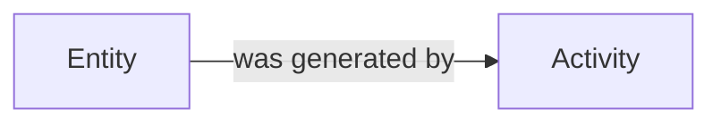
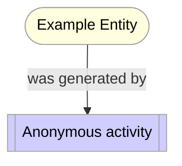
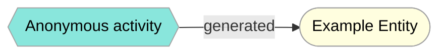
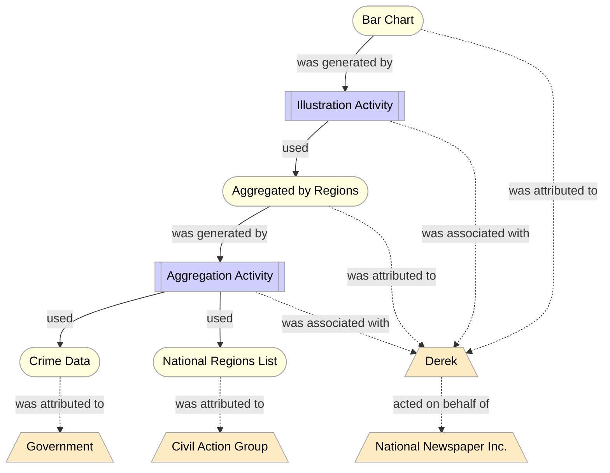
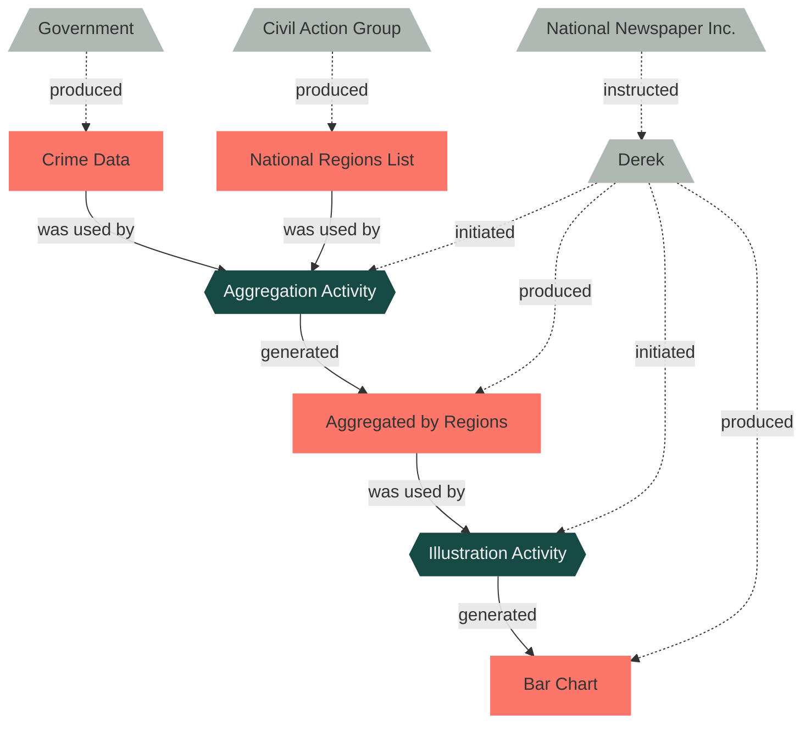

# README

The package supports the creation of [PROV-O](https://www.w3.org/TR/prov-o/) compliant provenance graphs.


## Installation

You can install the package from the Python Package Index (PyPI):

`pip install provo`

Or by downloading this repository:

1. Download and unzip the repository
2. Open Shell and _cd_ to unzipped repository
3. Run `pip install -e .` (in the folder that contains ```setup.py```)

## Contents

The package is a Python API to PROV-O. It implements the [PROV-O starting point classes](https://www.w3.org/TR/prov-o/#starting-points-figure) __Entity__, __Activity__ and __Agent__ as Python classes with methods to establish the _PROV-O starting point properties_ between instances of these classes.

## Features

The package's objective is to support the programmatical creation of provenance graphs that are compliant with the W3C Recommendation PROV-O: The PROV Ontology. Users of the package shall be enabled to tightly couple the generation of data with the generation of their provenance. As the package implements PROV-O, the created graph is exportable as an RDF document. Finally, the graph can be exported as a mermaid flowchart with some configuration options to adjust the style of the resulting chart.

### Compliance

- The PROV-O classes __Entity__, __Activity__, and __Agent__ are implemented as Python classes.
- The PROV-O properties _wasGeneratedBy_, _wasDerivedFrom_, _wasAttributedTo_, _startedAtTime_, _used_, _wasInformedBy_, _endedAtTime_, _wasAssociatedWith_, and _actedOnBehalfOf_ are implemented as instance methods of their according classes.
- Attributes that are passed to these methods are type-checked to enforce compliance with PROV-O.
- Node Ids are checked for validity.
- Use of the same ID for different objects throws an error.

### Ease of Use

- IDE support is provided via the implementation as Python classes according methods, and through type hints.
- The classes `Provence_Ontology_Graph`, `Entity`, `Activity`, and `Agent` can be printed to terminal in a user-friendly, readable way with the default `print()` command.
- Objects of the classes `Entity`, `Activity`, and `Agent` can be instantiated with auto-generated Ids (although it's not recommended using this for production).
- Export as [mermaid flowchart](https://mermaid-js.github.io/mermaid/#/flowchart) to review the graph visually.

### Interface to RDF via the [rdflib](https://rdflib.readthedocs.io/en/stable/) package

- The graph's contents can be converted to an `rdflib.Graph` object.
- The graph can be exported in various RDF serializations.

## Manual

The package is centered around the class `ProvenanceOntologyGraph`. Entities, Activities, and Agents are added to this graph using the according class methods. Relations between the PROV-O class objects are constructed using their respective class methods.

### Create a Provenance Ontology Graph

The graph can be initialized with default or user defined attributes. The graph can be printed to the terminal with `print(graph)`.

```python
# ex1 - create a provenance graph
from provo import ProvOntologyGraph

# __defaults__
# namespace: str = "https://provo-example.org/",
# namespace_abbreviation: str = "", 
# lang: str = "en"
provenance_graph = ProvOntologyGraph()

prov_ontology_graph = ProvOntologyGraph(
    namespace='http://example.org#',
    namespace_abbreviation="ex",
    lang="en"
)
```

`namespace=`

- Default is `"https://provo-example.org/"`.
- Has to be valid url, validation is currently performed with the [validators](https://pypi.org/project/validators/) package.
- Has to end with `/` or `#`.

`namespace_abbreviation=`

- Default is `""`.
- Used when converting to other models, such as RDF (-> prefixes)
- Only characters from the Latin alphabet are allowed.
- RDF core prefixes (*owl*, *rdf*, *rdfs*, *xsd* and *xml*) are prohibited from use.

>**Note** 
> Although not prohibited, the following prefixes are commonly used and thus recommended being avoided: *brick*, *csvw*, *dc*, *dcat*, *dcmitype*, *cdterms*, *dcam*, *doap*, *foaf*, *geo*, *odrl*, *org*, *prof*, *prov*, *qb*, *sdo*, *sh*, *skos*, *sosa*, *ssn*, *time*, *vann* and *void*.

`lang=`

- Default is `"en"`.
- Used when converting to other models that support a *lang* tag.
- Has to be compliant with [RFC 5646](https://www.rfc-editor.org/info/rfc5646) (Phillips, A., Ed., and M. Davis, Ed., "Tags for Identifying Languages", BCP 47, RFC 5646, September 2009). Compliance is not validated!

### Create Entities, Activities and Agents and define relations between them

The creation for classes follows the same pattern. The classes only differ in their methods. PROV-O Classes are instantiated by using the add methods of the provenance graph class. Below you find the `add_entity()` method of `ProvenanceOntologyGraph` for reference.

```python
# definition of add_entity() in ProvOntologyGraph()
def add_entity(self, 
    id: str = "", 
    label: str = "", 
    description: str = "", 
    use_namespace: bool = False) -> Entity:
    """creates a new entity, adds it to the graph and returns it then"""
    # if use_namespace is set to True, the given id is concatenated with the namespace that was defined at the creation of the ProvenanceOntologyGraph object.
    # The method _handle_id() checks whether the provided 
    # namespace-id combination is already used for a node in the graph and if it is a valid IRI. 
    # if no id is provided: id gets automatically generated, within the namespace of the ProvenanceOntologyGraph (Setting use_namespace to True and not providing an id, still creates a valid IRI).
    
    node_id = self._handle_id(id, use_namespace)
    # the PROV class (in this case an Entity) is only created if everything with the ID is fine
    entity = Entity(node_id=node_id, label=label,description=description)
    self._entities.append(entity)
    return entity
```

The relations are defined by calling the respective methods of the PROV class instances.

Example use of the provenance graph's add-methods and the definition of a *used*-relation between an Activity and an Entity:

```python
# ex2 - create entities, activities and agents, 
# and define relation between them
entity = prov_ontology_graph.add_entity(
    id="example_entity",
    label="Example Entity",
    use_namespace=True)

activity = prov_ontology_graph.add_activity(
    label="Anonymous activity",
    description="An arbitrary activity."
)

entity.was_generated_by(activity)

print(entity)
# id: http://example.org#example_entity
# label: Example Entity
# was generated by: ['Anonymous activity']
# ---

print(activity)
# id: http://example.org#94021a6a-40cd-4c02-9571-33480488ff82
# label: Anonymous activity
# description: An arbitrary activity.
# ---
```

### RDF interface

The graph can be directly serialized as RDF document or be converted to an `rdflib` Graph, for further manipulation.

```python
# ex3 - serialize provenance graph as RDF document
prov_ontology_graph.serialize_as_rdf("manual_examples.ttl")
```

```
@prefix : <http://example.org#> .
@prefix prov: <http://www.w3.org/ns/prov#> .
@prefix rdfs: <http://www.w3.org/2000/01/rdf-schema#> .

:example_entity a prov:Entity ;
    rdfs:label "Example Entity"@en ;
    prov:wasGeneratedBy :832b1ada-22f2-45b8-bdca-dfbe89fb68c8 .

:832b1ada-22f2-45b8-bdca-dfbe89fb68c8 a prov:Activity ;
    rdfs:label "Anonymous activity"@en ;
    rdfs:comment "An arbitrary activity."@en .
```

```python
# ex4 - interface with rdflib

from rdflib import SKOS, Literal, URIRef

rdflib_graph = prov_ontology_graph.get_rdflib_graph()

rdflib_graph.bind("skos", SKOS)

rdflib_graph.add((
    URIRef(entity.node_id), 
    SKOS.prefLabel, 
    Literal(entity.label, lang="en")
))

rdflib_graph.serialize("examples/rdflib_interface.ttl")
```
```
@prefix : <http://example.org#> .
@prefix prov: <http://www.w3.org/ns/prov#> .
@prefix rdfs: <http://www.w3.org/2000/01/rdf-schema#> .
@prefix skos: <http://www.w3.org/2004/02/skos/core#> .

:example_entity a prov:Entity ;
    rdfs:label "Example Entity"@en ;
    skos:prefLabel "Example Entity"@en ;
    prov:wasGeneratedBy :832b1ada-22f2-45b8-bdca-dfbe89fb68c8 .

:832b1ada-22f2-45b8-bdca-dfbe89fb68c8 a prov:Activity ;
    rdfs:label "Anonymous activity"@en ;
    rdfs:comment "An arbitrary activity."@en .
```

### Export as Mermaid Flowchart

Mermaid is a"[...] diagramming and charting tool that renders Markdown-inspired text definitions [...]". It can be embedded in markdown documents like so:

````markdown

````

If the markdown interpreter supports mermaid, this results in:


> **Note**
> To convert Mermaid charts into other formats the software [`mermaid-cli`](https://github.com/mermaid-js/mermaid-cli) is recommended.
> You can also use the [Mermaid Live Editor](https://mermaid.live/) to edit (and convert) the document.

To export the provenance graph as mermaid chart call the according export method:

```python
# ex5

prov_ontology_graph.export_as_mermaid_flowchart(file_name="examples/manual_examples_flowchart_default.md")
```



The style of the resulting graph is defined by a dictionary that holds the default style values. To change the styling, a dictionary can be passed to the method by using the `user_options` argument. If this is done, the configurations that are defined in the user options overwrite the according default configurations. A reference and some more details concerning the options dictionary can be found below.

```python
# ex6

options = {
    "orientation": "LR",
    "invert-relations": True,
    "activity": {
        "fill": "#89e6dc",
        "shape": "{{:}}"
    }
}

prov_ontology_graph.export_as_mermaid_flowchart(
    file_name="examples/manual_examples_flowchart.md", 
    user_options = options)
```



To adjust details and to generate PNGs or SVGs you can copy the mermaid graph content to the [Mermaid Live Editor](https://mermaid.live/).

#### User Options Reference

The default styling configuration mimics the graph styling from the PROV-O reference page and is defined as follows:

```python
options = {
    "invert-relations": False,
    "orientation": "TD",            
    "included-relations": [
        "was_generated_by",
        "was_attributed_to",
        "used",
        "was_associated_with",
        "acted_on_behalf_of"
    ],
    "color": "#000000",
    "stroke": "#a4a4a4",
    "stroke-width": "1px",
    "relation-style": "-",
    "entity": {
        "fill": "#fffedf",
        "shape": "([:])",
        "relation-style": None,
        "color": None,
        "stroke": None,
        "stroke-width": None
    },
    "activity": {
        "fill": "#cfceff",
        "shape": "[[:]]",
        "relation-style": None,
        "color": None,
        "stroke": None,
        "stroke-width": None
    },
    "agent": {
        "fill": "#ffebc3",
        "shape": "[/:\\]",
        "relation-style": ".",
        "color": None,
        "stroke":  None,
        "stroke-width": None
    }
}
```

__Reference Table__

| keyword            | options                               | explanation                                                                                                                                                                                                                                                          |
| ------------------ | ------------------------------------- | -------------------------------------------------------------------------------------------------------------------------------------------------------------------------------------------------------------------------------------------------------------------- |
| invert-relations   | True \| False                         | Reverts the arrows and changes the labels accordingly. The reverted labels are not defined by PROV, and thus they are not compliant to the PROV model.                                                                                                               |
| orientation        | "TD" \| "LR"                          | Top-down or left-right orientation of the graph (mermaid syntax).                                                                                                                                                                                                    |
| included-relations | list of displayed relations           | Defines which relations should be displayed. Per default "was_derived_by" and "was_informed_by" are excluded. Possible values are: "was_generated_by", was_derived_by", "was_attributed_to", "used", "was_informed_by", "was_associated_with", "acted_on_behalf_of". |
| fill               | "\<#color-hex-code\>", e.g. "#fffedf" | Defines the color of the nodes.                                                                                                                                                                                                                                      |
| shape              | "\<shape identifier\>", e.g. "[:]"    | Uses [mermaid shape syntax](https://mermaid-js.github.io/mermaid/#/flowchart?id=node-shapes). The colon separates the opening symbols from the closing symbols.                                                                                                      |
| color              | "\<#color-hex-code\>"                 | Defines the color of the nodes' texts.                                                                                                                                                                                                                               |
| stroke             | "\<#color-hex-code\>"                 | Defines the color of the nodes' borders                                                                                                                                                                                                                              |
| stroke-width       | "\<border width in px\>", e.g. "1px"  | Defines the width of the nodes' borders.                                                                                                                                                                                                                             |
| relation-style     | "-" (solid) \| "." (dashed)           | Defines the style of the relations. Only two options are available.                                                                                                                                                                                                  |
| entity             | dict                                  | Specify fill, shape, color, stroke, stroke-with and relation-style for entities. If any value is `None`, it falls back to the op level definitions                                                                                                                   |
| activity           | dict                                  | see entity                                                                                                                                                                                                                                                           |
| agent              | dict                                  | see entity                                                                                                                                                                                                                                                           |

If further styling configuration is required, users have to interact directly with the resulting mermaid-md.


## Comprehensive Examples

Code to create the PROV-O [example 1](https://www.w3.org/TR/prov-o/#narrative-example-simple-1)

```python
from datetime import datetime

from provo import ProvOntologyGraph
from rdflib import FOAF, RDF, Literal, URIRef

# create example from: https://www.w3.org/TR/prov-o/#narrative-example-simple-1


# create graph
prov_ontology_graph = ProvOntologyGraph(
    namespace='http://example.org#',
    namespace_abbreviation=""
)

# create entities
crime_data = prov_ontology_graph.add_entity(
    id='crimeData', 
    label='Crime Data',
    use_namespace=True)
national_regions_list = prov_ontology_graph.add_entity(
    id='nationalRegionsList', 
    label='National Regions List',
    use_namespace=True)
aggregated_by_regions = prov_ontology_graph.add_entity(
    id='aggregatedByRegions', 
    label='Aggregated by Regions',
    use_namespace=True)
bar_chart = prov_ontology_graph.add_entity(
    id='bar_chart', 
    label='Bar Chart',
    use_namespace=True)

# create activities
aggregation_activity = prov_ontology_graph.add_activity(
    id='aggregationActivity', 
    label='Aggregation Activity',
    use_namespace=True)
illustration_activity = prov_ontology_graph.add_activity(
    id='illustrationActivity', 
    label='Illustration Activity',
    use_namespace=True)

# create agents
government = prov_ontology_graph.add_agent(
    id='government', 
    label='Government',
    use_namespace=True)
civil_action_group = prov_ontology_graph.add_agent(
    id='civil_action_group', 
    label='Civil Action Group',
    use_namespace=True)
national_newspaper_inc = prov_ontology_graph.add_agent(
    id='national_newspaper_inc', 
    label='National Newspaper Inc.',
    use_namespace=True)
derek = prov_ontology_graph.add_agent(
    id='derek', 
    label='Derek',
    use_namespace=True)

# build relations
crime_data.was_attributed_to(government)
national_regions_list.was_attributed_to(civil_action_group)

aggregation_activity.used(crime_data)
aggregation_activity.used(national_regions_list)
aggregation_activity.started_at_time(datetime(2011, 7, 14, 1, 1, 1))
aggregation_activity.ended_at_time(datetime(2011, 7, 14, 2, 2, 2))
aggregation_activity.was_associated_with(derek)

aggregated_by_regions.was_generated_by(aggregation_activity)
aggregated_by_regions.was_attributed_to(derek)

illustration_activity.was_informed_by(aggregation_activity)
illustration_activity.used(aggregated_by_regions)
illustration_activity.was_associated_with(derek)

bar_chart.was_generated_by(illustration_activity)
bar_chart.was_derived_from(aggregated_by_regions)
bar_chart.was_attributed_to(derek)

derek.acted_on_behalf_of(national_newspaper_inc)

# print graph to terminal
print(prov_ontology_graph)

# use rdflib interface to add FOAF triples
rdflib_graph = prov_ontology_graph.get_rdflib_graph()

rdflib_graph.bind("foaf", FOAF)

rdflib_graph.add((
    URIRef(government.node_id),
    RDF.type,
    FOAF.Organization
))

rdflib_graph.add((
    URIRef(civil_action_group.node_id),
    RDF.type,
    FOAF.Organization
))

rdflib_graph.add((
    URIRef(national_newspaper_inc.node_id),
    RDF.type,
    FOAF.Organization
))

rdflib_graph.add((
    URIRef(national_newspaper_inc.node_id),
    FOAF.name,
    Literal(national_newspaper_inc.label, lang="en")
))

rdflib_graph.add((
    URIRef(derek.node_id),
    RDF.type,
    FOAF.Person
))

rdflib_graph.add((
    URIRef(derek.node_id),
    FOAF.givenName,
    Literal(derek.label, lang="en")
))

rdflib_graph.add((
    URIRef(derek.node_id),
    FOAF.mbox,
    URIRef("mailto:derek@example.org")
))
# serialize graph as rdf document
rdflib_graph.serialize('examples/provenance_graph_example.ttl')


# export mermaid-md with default_options
prov_ontology_graph.export_as_mermaid_flowchart(file_name="examples/provenance_mermaid_default.md")

# with adjusted options
# prov_ontology_graph.export_as_mermaid_flowchart(
#     file_name="examples/provenance_mermaid.md",
#     user_options=options)

```

__Default mermaid graph:__


__User defined mermaid graph:__

```python
options = {
    "invert-relations": True,
    "entity": {
        "shape": "[:]",
        "fill": "#FC766AFF",
        "stroke": "#FC766AFF",
        "color": "333"
    },
    "agent": {
        "shape": "[/:\\]",
        "stroke":"#B0B8B4FF",
        "fill": "#B0B8B4FF",               
        "color": "333",
        "relation-style": "."
    },
    "activity": {
        "shape": "{{:}}",
        "fill": "#184A45FF",
        "stroke": "#184A45FF",
        "color": "#eee"       
    }
}
```




