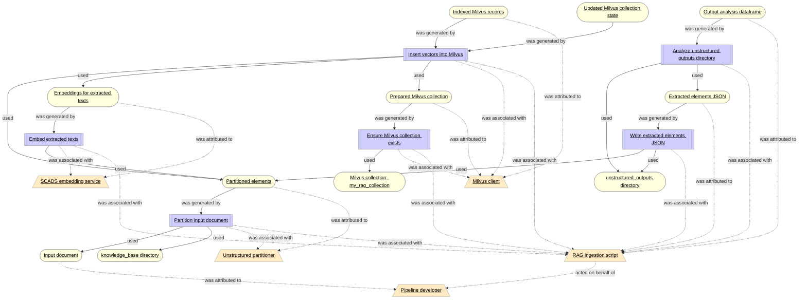

```mermaid
flowchart TD
classDef entity fill:#fffedf
classDef entity color:#000000
classDef entity stroke:#a4a4a4
classDef entity stroke-width:1px
classDef activity fill:#cfceff
classDef activity color:#000000
classDef activity stroke:#a4a4a4
classDef activity stroke-width:1px
classDef agent fill:#ffebc3
classDef agent color:#000000
classDef agent stroke:#a4a4a4
classDef agent stroke-width:1px
https://example.org/rag-ingestion#knowledge-base-dir([<a style=color:inherit href=https://example.org/rag-ingestion#knowledge-base-dir>knowledge_base directory</a>]):::entity
https://example.org/rag-ingestion#unstructured-outputs-dir([<a style=color:inherit href=https://example.org/rag-ingestion#unstructured-outputs-dir>unstructured_outputs directory</a>]):::entity
https://example.org/rag-ingestion#my-rag-collection([<a style=color:inherit href=https://example.org/rag-ingestion#my-rag-collection>Milvus collection: my_rag_collection</a>]):::entity
https://example.org/rag-ingestion#prepared-collection([<a style=color:inherit href=https://example.org/rag-ingestion#prepared-collection>Prepared Milvus collection</a>]):::entity
https://example.org/rag-ingestion#prepared-collection-- <a style=color:inherit>was generated by</a> -->https://example.org/rag-ingestion#ensure-collection
https://example.org/rag-ingestion#prepared-collection-. <a style=color:inherit>was attributed to</a> .->https://example.org/rag-ingestion#milvus-client
https://example.org/rag-ingestion#source-doc-1([<a style=color:inherit href=https://example.org/rag-ingestion#source-doc-1>Input document</a>]):::entity
https://example.org/rag-ingestion#source-doc-1-. <a style=color:inherit>was attributed to</a> .->https://example.org/rag-ingestion#developer
https://example.org/rag-ingestion#partitioned-elements-doc-1([<a style=color:inherit href=https://example.org/rag-ingestion#partitioned-elements-doc-1>Partitioned elements</a>]):::entity
https://example.org/rag-ingestion#partitioned-elements-doc-1-- <a style=color:inherit>was generated by</a> -->https://example.org/rag-ingestion#partition-doc-1
https://example.org/rag-ingestion#partitioned-elements-doc-1-. <a style=color:inherit>was attributed to</a> .->https://example.org/rag-ingestion#unstructured-partitioner
https://example.org/rag-ingestion#elements-json-doc-1([<a style=color:inherit href=https://example.org/rag-ingestion#elements-json-doc-1>Extracted elements JSON</a>]):::entity
https://example.org/rag-ingestion#elements-json-doc-1-- <a style=color:inherit>was generated by</a> -->https://example.org/rag-ingestion#write-json-doc-1
https://example.org/rag-ingestion#elements-json-doc-1-. <a style=color:inherit>was attributed to</a> .->https://example.org/rag-ingestion#rag-ingestion-script
https://example.org/rag-ingestion#embeddings-doc-1([<a style=color:inherit href=https://example.org/rag-ingestion#embeddings-doc-1>Embeddings for extracted texts</a>]):::entity
https://example.org/rag-ingestion#embeddings-doc-1-- <a style=color:inherit>was generated by</a> -->https://example.org/rag-ingestion#embed-doc-1
https://example.org/rag-ingestion#embeddings-doc-1-. <a style=color:inherit>was attributed to</a> .->https://example.org/rag-ingestion#scads-embedding-service
https://example.org/rag-ingestion#indexed-records-doc-1([<a style=color:inherit href=https://example.org/rag-ingestion#indexed-records-doc-1>Indexed Milvus records</a>]):::entity
https://example.org/rag-ingestion#indexed-records-doc-1-- <a style=color:inherit>was generated by</a> -->https://example.org/rag-ingestion#insert-doc-1
https://example.org/rag-ingestion#indexed-records-doc-1-. <a style=color:inherit>was attributed to</a> .->https://example.org/rag-ingestion#milvus-client
https://example.org/rag-ingestion#updated-collection-doc-1([<a style=color:inherit href=https://example.org/rag-ingestion#updated-collection-doc-1>Updated Milvus collection state</a>]):::entity
https://example.org/rag-ingestion#updated-collection-doc-1-- <a style=color:inherit>was generated by</a> -->https://example.org/rag-ingestion#insert-doc-1
https://example.org/rag-ingestion#analysis-dataframe([<a style=color:inherit href=https://example.org/rag-ingestion#analysis-dataframe>Output analysis dataframe</a>]):::entity
https://example.org/rag-ingestion#analysis-dataframe-- <a style=color:inherit>was generated by</a> -->https://example.org/rag-ingestion#analyze-outputs
https://example.org/rag-ingestion#analysis-dataframe-. <a style=color:inherit>was attributed to</a> .->https://example.org/rag-ingestion#rag-ingestion-script
https://example.org/rag-ingestion#ensure-collection[[<a style=color:inherit href=https://example.org/rag-ingestion#ensure-collection>Ensure Milvus collection exists</a>]]:::activity
https://example.org/rag-ingestion#ensure-collection-- <a style=color:inherit>used</a> -->https://example.org/rag-ingestion#my-rag-collection
https://example.org/rag-ingestion#ensure-collection-. <a style=color:inherit>was associated with</a> .->https://example.org/rag-ingestion#milvus-client
https://example.org/rag-ingestion#ensure-collection-. <a style=color:inherit>was associated with</a> .->https://example.org/rag-ingestion#rag-ingestion-script
https://example.org/rag-ingestion#partition-doc-1[[<a style=color:inherit href=https://example.org/rag-ingestion#partition-doc-1>Partition input document</a>]]:::activity
https://example.org/rag-ingestion#partition-doc-1-- <a style=color:inherit>used</a> -->https://example.org/rag-ingestion#source-doc-1
https://example.org/rag-ingestion#partition-doc-1-- <a style=color:inherit>used</a> -->https://example.org/rag-ingestion#knowledge-base-dir
https://example.org/rag-ingestion#partition-doc-1-. <a style=color:inherit>was associated with</a> .->https://example.org/rag-ingestion#unstructured-partitioner
https://example.org/rag-ingestion#partition-doc-1-. <a style=color:inherit>was associated with</a> .->https://example.org/rag-ingestion#rag-ingestion-script
https://example.org/rag-ingestion#write-json-doc-1[[<a style=color:inherit href=https://example.org/rag-ingestion#write-json-doc-1>Write extracted elements JSON</a>]]:::activity
https://example.org/rag-ingestion#write-json-doc-1-- <a style=color:inherit>used</a> -->https://example.org/rag-ingestion#partitioned-elements-doc-1
https://example.org/rag-ingestion#write-json-doc-1-- <a style=color:inherit>used</a> -->https://example.org/rag-ingestion#unstructured-outputs-dir
https://example.org/rag-ingestion#write-json-doc-1-. <a style=color:inherit>was associated with</a> .->https://example.org/rag-ingestion#rag-ingestion-script
https://example.org/rag-ingestion#embed-doc-1[[<a style=color:inherit href=https://example.org/rag-ingestion#embed-doc-1>Embed extracted texts</a>]]:::activity
https://example.org/rag-ingestion#embed-doc-1-- <a style=color:inherit>used</a> -->https://example.org/rag-ingestion#partitioned-elements-doc-1
https://example.org/rag-ingestion#embed-doc-1-. <a style=color:inherit>was associated with</a> .->https://example.org/rag-ingestion#scads-embedding-service
https://example.org/rag-ingestion#embed-doc-1-. <a style=color:inherit>was associated with</a> .->https://example.org/rag-ingestion#rag-ingestion-script
https://example.org/rag-ingestion#insert-doc-1[[<a style=color:inherit href=https://example.org/rag-ingestion#insert-doc-1>Insert vectors into Milvus</a>]]:::activity
https://example.org/rag-ingestion#insert-doc-1-- <a style=color:inherit>used</a> -->https://example.org/rag-ingestion#partitioned-elements-doc-1
https://example.org/rag-ingestion#insert-doc-1-- <a style=color:inherit>used</a> -->https://example.org/rag-ingestion#embeddings-doc-1
https://example.org/rag-ingestion#insert-doc-1-- <a style=color:inherit>used</a> -->https://example.org/rag-ingestion#prepared-collection
https://example.org/rag-ingestion#insert-doc-1-. <a style=color:inherit>was associated with</a> .->https://example.org/rag-ingestion#milvus-client
https://example.org/rag-ingestion#insert-doc-1-. <a style=color:inherit>was associated with</a> .->https://example.org/rag-ingestion#rag-ingestion-script
https://example.org/rag-ingestion#analyze-outputs[[<a style=color:inherit href=https://example.org/rag-ingestion#analyze-outputs>Analyze unstructured outputs directory</a>]]:::activity
https://example.org/rag-ingestion#analyze-outputs-- <a style=color:inherit>used</a> -->https://example.org/rag-ingestion#unstructured-outputs-dir
https://example.org/rag-ingestion#analyze-outputs-- <a style=color:inherit>used</a> -->https://example.org/rag-ingestion#elements-json-doc-1
https://example.org/rag-ingestion#analyze-outputs-. <a style=color:inherit>was associated with</a> .->https://example.org/rag-ingestion#rag-ingestion-script
https://example.org/rag-ingestion#rag-ingestion-script[/<a style=color:inherit href=https://example.org/rag-ingestion#rag-ingestion-script>RAG ingestion script</a>\]:::agent
https://example.org/rag-ingestion#rag-ingestion-script-. <a style=color:inherit>acted on behalf of</a> .->https://example.org/rag-ingestion#developer
https://example.org/rag-ingestion#developer[/<a style=color:inherit href=https://example.org/rag-ingestion#developer>Pipeline developer</a>\]:::agent
https://example.org/rag-ingestion#unstructured-partitioner[/<a style=color:inherit href=https://example.org/rag-ingestion#unstructured-partitioner>Unstructured partitioner</a>\]:::agent
https://example.org/rag-ingestion#scads-embedding-service[/<a style=color:inherit href=https://example.org/rag-ingestion#scads-embedding-service>SCADS embedding service</a>\]:::agent
https://example.org/rag-ingestion#milvus-client[/<a style=color:inherit href=https://example.org/rag-ingestion#milvus-client>Milvus client</a>\]:::agent
```