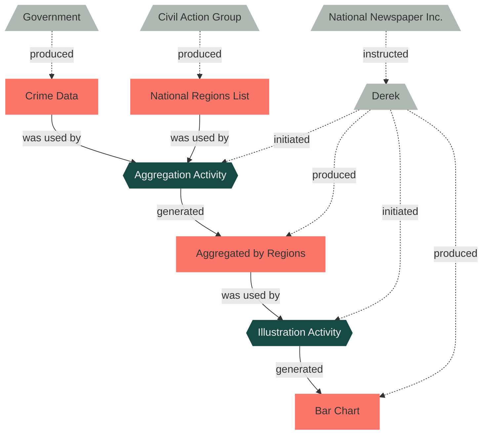

```mermaid
flowchart TD
classDef entity fill:#FC766AFF
classDef entity color:333
classDef entity stroke:#FC766AFF
classDef entity stroke-width:1px
classDef activity fill:#184A45FF
classDef activity color:#eee
classDef activity stroke:#184A45FF
classDef activity stroke-width:1px
classDef agent fill:#B0B8B4FF
classDef agent color:333
classDef agent stroke:#B0B8B4FF
classDef agent stroke-width:1px
http://example.org#crimeData[Crime Data]:::entity
http://example.org#government-. produced .->http://example.org#crimeData
http://example.org#nationalRegionsList[National Regions List]:::entity
http://example.org#civil_action_group-. produced .->http://example.org#nationalRegionsList
http://example.org#aggregatedByRegions[Aggregated by Regions]:::entity
http://example.org#aggregationActivity-- generated -->http://example.org#aggregatedByRegions
http://example.org#derek-. produced .->http://example.org#aggregatedByRegions
http://example.org#bar_chart[Bar Chart]:::entity
http://example.org#illustrationActivity-- generated -->http://example.org#bar_chart
http://example.org#derek-. produced .->http://example.org#bar_chart
http://example.org#aggregationActivity{{Aggregation Activity}}:::activity
http://example.org#crimeData-- was used by -->http://example.org#aggregationActivity
http://example.org#nationalRegionsList-- was used by -->http://example.org#aggregationActivity
http://example.org#derek-. initiated .->http://example.org#aggregationActivity
http://example.org#illustrationActivity{{Illustration Activity}}:::activity
http://example.org#aggregatedByRegions-- was used by -->http://example.org#illustrationActivity
http://example.org#derek-. initiated .->http://example.org#illustrationActivity
http://example.org#government[/Government\]:::agent
http://example.org#civil_action_group[/Civil Action Group\]:::agent
http://example.org#national_newspaper_inc[/National Newspaper Inc.\]:::agent
http://example.org#derek[/Derek\]:::agent
http://example.org#national_newspaper_inc-. instructed .->http://example.org#derek
```